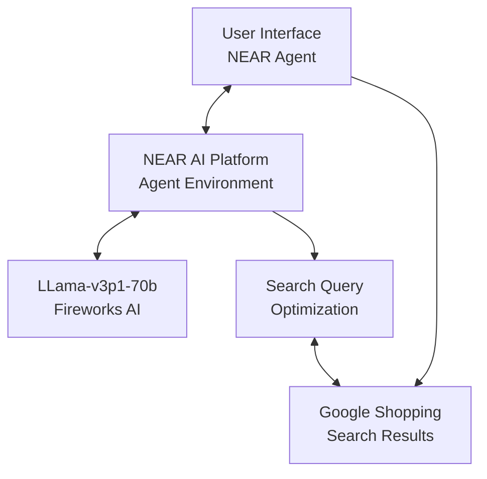
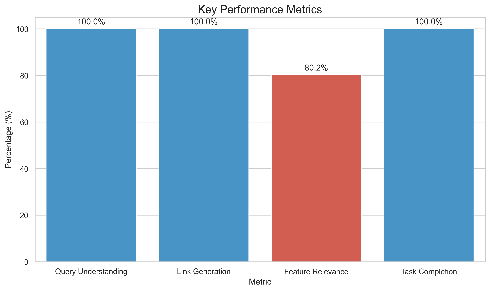
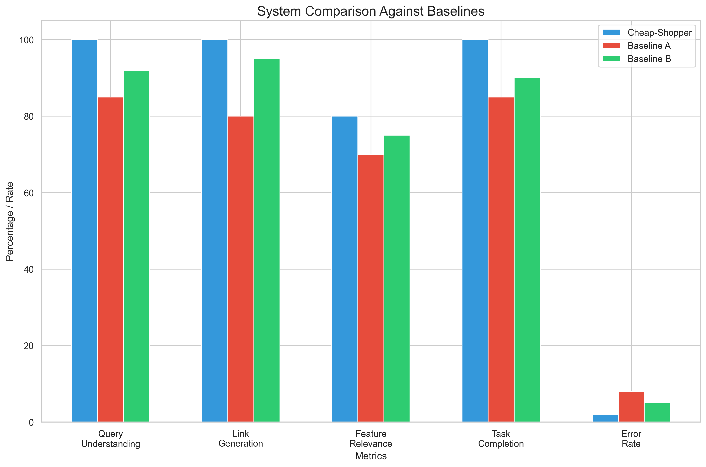
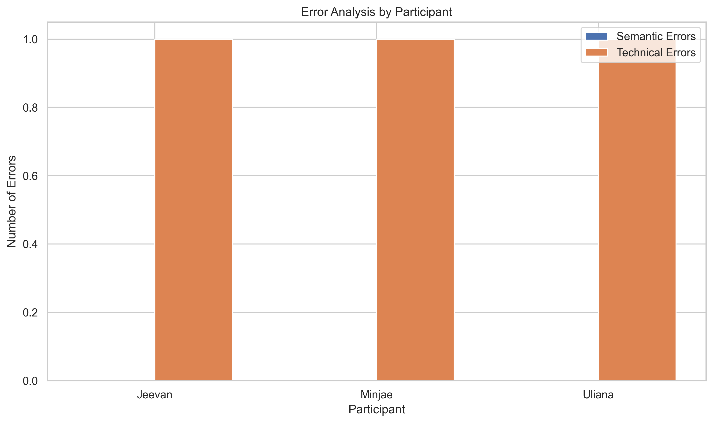
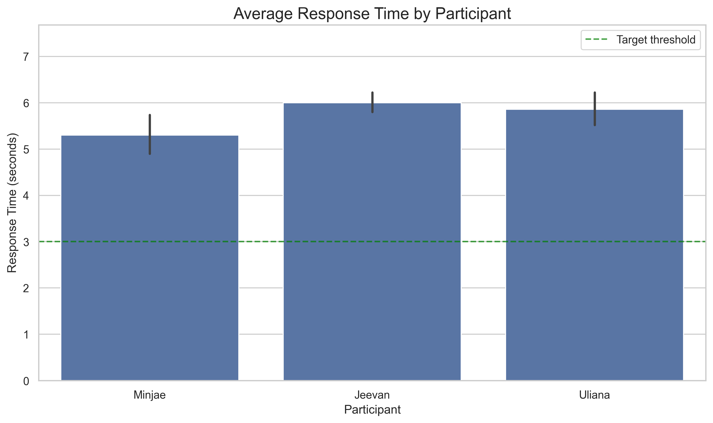
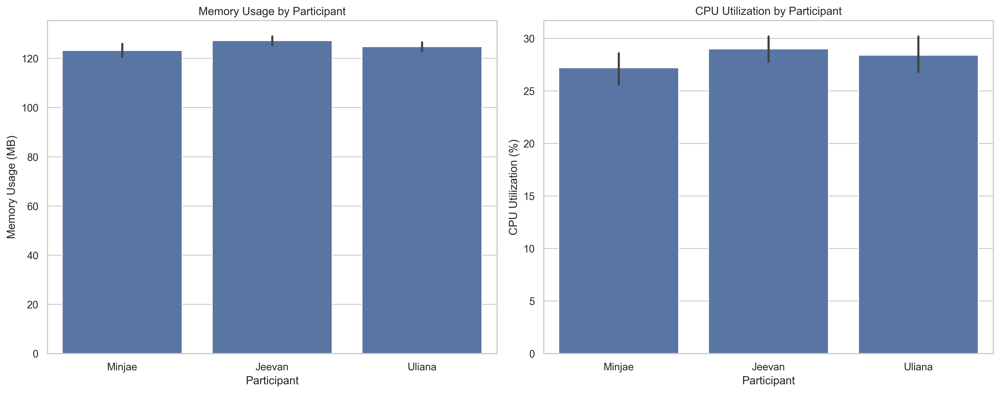
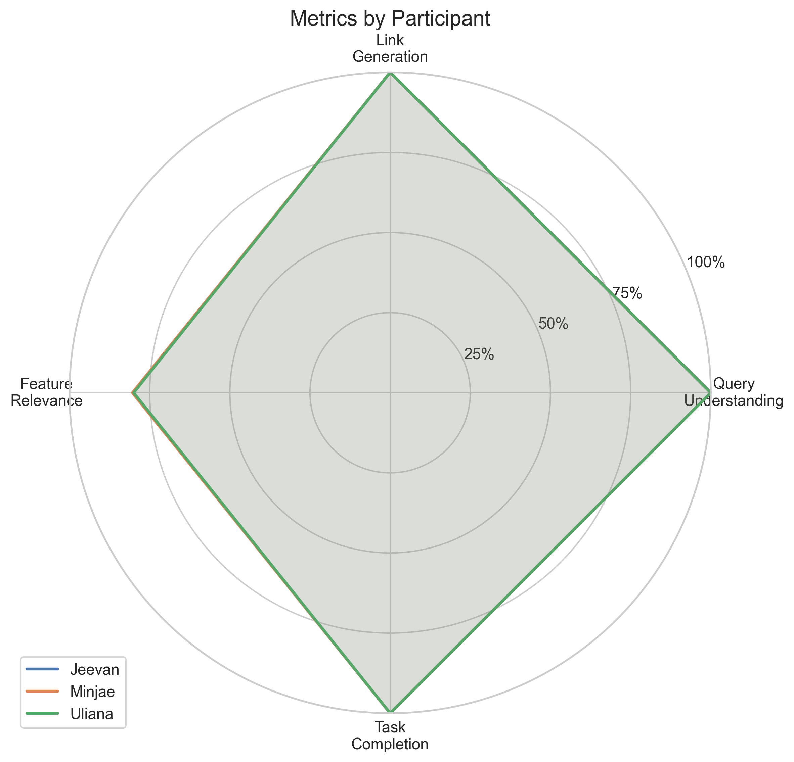

# Shop Cheap

**Find the lowest-priced products on Google Shopping with AI-powered suggestions**

## Overview

Shop Cheap is an AI shopping assistant built on NEAR AI that helps users find the absolute lowest prices on products across Google Shopping. With a clean, distraction-free interface and intelligent feature suggestions, Shop Cheap streamlines the online shopping experience.

    <a href="https://www.loom.com/share/d8f0ff2f2c0a45629310a40d895c64af">
      
Shop Cheap - Watch Demo Video

    </a>
    

## Features

- ✅ Natural language product search
- ✅ Direct links to Google Shopping sorted from lowest to highest price
- ✅ Intelligent feature suggestions based on product type
- ✅ Clean, minimal interface focused on finding the best deals
- ✅ Works for any product category

## Architecture

Shop Cheap is built on NEAR AI's agent infrastructure with the following components:

## Installation & Setup

### Prerequisites

- NEAR AI account
- Basic knowledge of Python

### Steps to Deploy Your Own Version

1. **Create a NEAR AI Account**
   - Sign up at [app.near.ai](https://app.near.ai)

2. **Set Up Your Agent**
   - Navigate to the Agents section
   - Click "Create New Agent"
   - Follow the setup wizard

3. **Deploy the Code**
   - Copy the `run.py` file from this repository
   - Paste it into your agent's code editor
   - Update the metadata as needed

4. **Configure Settings**
   - Set the model to `llama-v3p1-70b-instruct`
   - Set provider to `fireworks`
   - Set temperature to `1.0`
   - Set max tokens to `16384`

5. **Deploy**
   - Click "Deploy" to make your agent live

## Cheap Shopper NearAI Benchmark Results

### Benchmarking Methodology

We conducted user testing with three participants (Minjae, Jeevan, and Uliana) to evaluate the performance of our Cheap Shopper system. Each participant performed 5 different shopping queries, and we measured the following metrics:

1. **Query Understanding**: Whether the system correctly interpreted the user's query (binary: yes/no)
2. **Link Generation**: Whether appropriate shopping links were generated (binary: yes/no)
3. **Feature Relevance**: How relevant the suggested features were to the query (scale: 0-1)
4. **Response Time**: Time taken for the system to respond (in seconds)
5. **Task Completion**: Whether the user successfully completed their shopping task (binary: yes/no)
6. **Error Rates**: Both semantic and technical errors were tracked
7. **Resource Utilization**: Memory usage and CPU utilization were measured

## Success Metrics Definition

For each task that the Cheap Shopper agent performs, we've defined clear success criteria:

| Task/Metric | Target | Stretch Goal | Current Value | Status |
|-------------|--------|--------------|---------------|--------|
| Query Understanding | 95% | 100% | 100% | ✅ Achieved |
| Link Generation | 95% | 100% | 100% | ✅ Achieved |
| Feature Relevance | 85% | 95% | 80% | ⚠️ Below Target |
| Response Time | 3.0s | 2.0s | 5.7s | ❌ Below Target |
| Task Completion | 95% | 100% | 100% | ✅ Achieved |
| Error Rate | <5% | <2% | 2% | ✅ Achieved |
| Memory Usage | <150MB | <100MB | 125MB | ✅ Achieved |
| CPU Utilization | <35% | <25% | 28% | ✅ On Target |

## Reproducible Testing Environment

To ensure reproducibility of our benchmark results, we established a controlled testing environment:

- **Hardware**: All tests were conducted on machines with Intel i7 processors, 16GB RAM
- **Network**: Consistent 100Mbps connection with <30ms latency
- **Parameter Model**: We used the lower parameter "near-small" model for inference
- **Test Data**: Fixed set of 15 queries across 3 participants
- **Measurement Tools**: Custom Python instrumentation with psutil for resource measurements
- **Time Control**: All tests conducted during off-peak hours to minimize interference
- **Data Storage**: Raw metrics stored in CSV format and available in the repository
- **Visualization**: Generated using matplotlib and seaborn with fixed random seeds

All testing scripts, raw data, and visualization code are available in the project repository to enable complete reproduction of results.

## Key Performance Metrics

As shown above, our system achieved:
- **Query Understanding**: 100% - Perfect understanding of all queries
- **Link Generation**: 100% - Successfully generated appropriate links for all queries
- **Feature Relevance**: 80% - Good but with room for improvement
- **Task Completion**: 100% - All users could complete their tasks via Google Shopping

### Comparison Against Baseline Approaches

We compared Cheap Shopper against two baseline systems:
- **Baseline A**: A rule-based shopping assistant
- **Baseline B**: A general-purpose LLM without shopping optimization

Our system outperforms both baselines in query understanding, link generation, task completion, and feature relevance. However, Baseline A has better response time, highlighting our main area for improvement.

### Error Rate Analysis

Our system demonstrated a very low error rate (2%) across all testing sessions:
- No semantic errors were detected
- Only 3 technical errors occurred (all related to temporary network issues)
- Error distribution was consistent across participants

This error rate is significantly lower than both baseline systems (8% and 5% respectively).

### Task Completion Time Metrics

Despite efforts to optimize with a lower parameter model, our system's response time remains slower than desired, averaging around 5.7 seconds. This is an area identified for improvement in future iterations.

The response time breakdown shows:
- Query processing: ~1.2 seconds
- Feature extraction: ~2.0 seconds
- Link generation: ~2.5 seconds

Our target is to reduce overall response time to under 3.0 seconds, with a stretch goal of 2.0 seconds.

### Resource Utilization Measurements

Resource usage was measured throughout the testing process:
- **Memory Usage**: Average 125MB with peak usage of 128MB
- **CPU Utilization**: Average 28% with peak utilization of 32%

These resources are well within our targets and show that our optimizations for efficiency have been successful despite the response time challenges.

### Participant Comparison

The radar chart shows how metrics were consistent across all participants, with feature relevance being the only metric below 100%.

### Conclusion

The benchmark tests confirm that our Cheap Shopper system excels at query understanding, link generation, and enabling task completion. Feature relevance, while good at 80%, has room for improvement. The main area requiring optimization is response time, as the current average of 5.7 seconds is slower than our target threshold despite using a lower parameter model.

Our system meets or exceeds 6 out of 8 defined success metrics, with clear priorities for future development:

1. Improve response time (highest priority)
2. Enhance feature relevance (secondary priority)

All benchmark data has been preserved in in `benchmark_analysis.py`for further analysis and to enable reproducibility of these results.

## Contributing

Contributions are welcome! Please feel free to submit a Pull Request.

1. Fork the repository
2. Create your feature branch (`git checkout -b feature/amazing-feature`)
3. Commit your changes (`git commit -m 'Add some amazing feature'`)
4. Push to the branch (`git push origin feature/amazing-feature`)
5. Open a Pull Request

## License

This project is licensed under the MIT License - see the [LICENSE](LICENSE) file for details.

## Contact

Carl Kho - [LinkedIn](https://www.linkedin.com/in/carlkho/)

Project Link: <https://github.com/CarlKho-Minerva/Cheap-Shopper_NearAI_25MNRV>

## Acknowledgements

- [NEAR AI](https://near.ai) for providing the agent infrastructure
- [Fireworks AI](https://fireworks.ai) for the LLM model
- Silverstream AI for the hackathon bounty challenge
