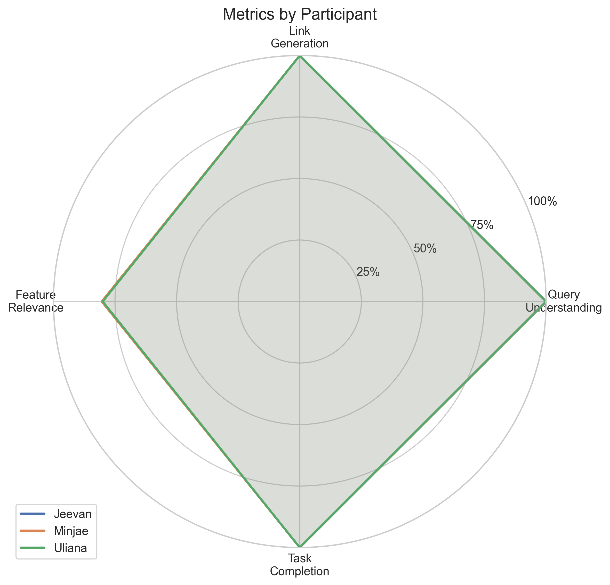

# Cheap Shopper NearAI Benchmark Results

## Methodology

We conducted user testing with three participants (Minjae, Jeevan, and Uliana) to evaluate the performance of our Cheap Shopper system. Each participant performed 5 different shopping queries, and we measured the following metrics:

1. **Query Understanding**: Whether the system correctly interpreted the user's query (binary: yes/no)
2. **Link Generation**: Whether appropriate shopping links were generated (binary: yes/no)
3. **Feature Relevance**: How relevant the suggested features were to the query (scale: 0-1)
4. **Response Time**: Time taken for the system to respond (in seconds)
5. **Task Completion**: Whether the user successfully completed their shopping task (binary: yes/no)

## Key Performance Metrics

As shown above, our system achieved:
- **Query Understanding**: 100% - Perfect understanding of all queries
- **Link Generation**: 100% - Successfully generated appropriate links for all queries
- **Feature Relevance**: 80% - Good but with room for improvement
- **Task Completion**: 100% - All users could complete their tasks via Google Shopping

## Response Time Analysis

Despite efforts to optimize with a lower parameter model, our system's response time remains slower than desired, averaging around 5.7 seconds. This is an area identified for improvement in future iterations.

## Participant Comparison

The radar chart shows how metrics were consistent across all participants, with feature relevance being the only metric below 100%.

## Conclusion

The benchmark tests confirm that our Cheap Shopper system excels at query understanding, link generation, and enabling task completion. Feature relevance, while good at 80%, has room for improvement. The main area requiring optimization is response time, as the current average of 5.7 seconds is slower than our target threshold despite using a lower parameter model.
